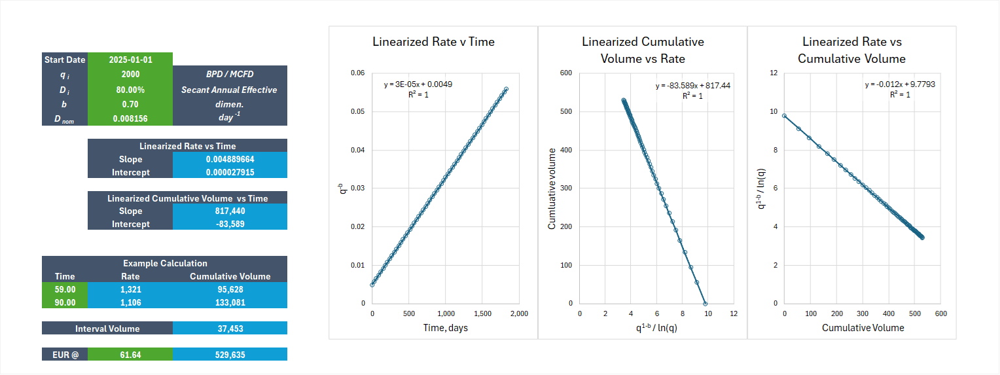

# Linearization of Arps hyperbolic functions

David S. Fulford, 2025

This is a simple example illustrating how to linearize the Arps Hyperbolic functions time-rate and rate-cum relationships. It should also demonstrate the obviousness of why the cum-time relationship cannot be linearized.

The spreadsheet calculates linear models for each relationship, and provides vectorized calculations for cumulative volume using time (days) as input.

